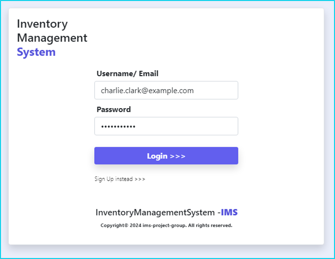
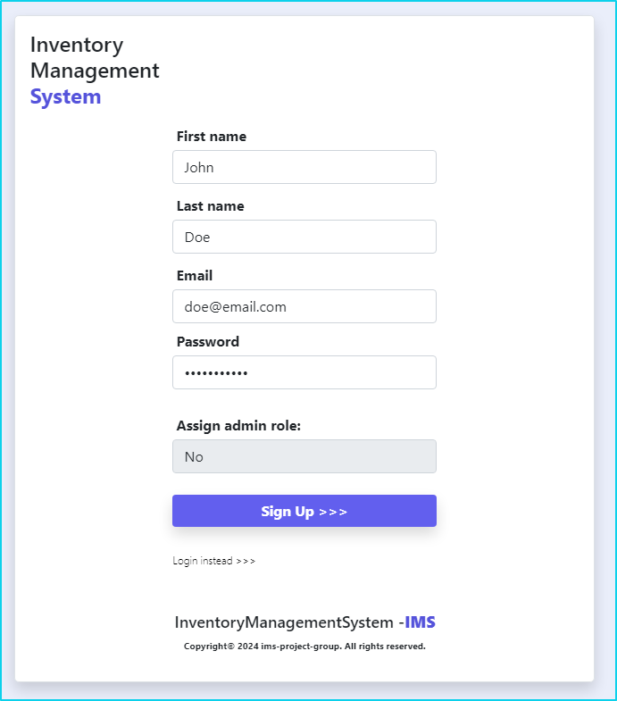
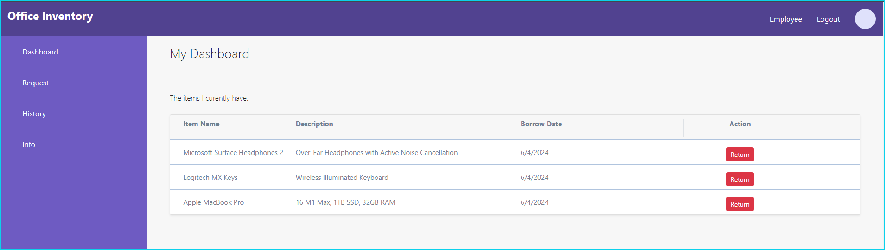
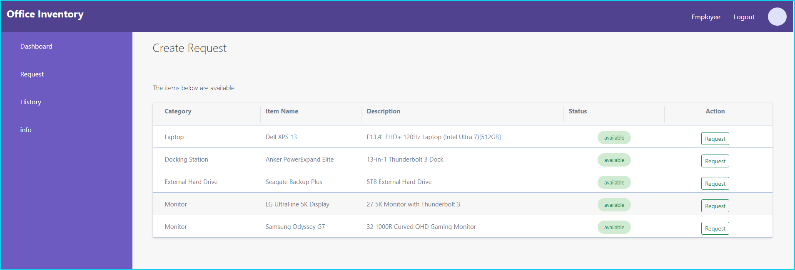
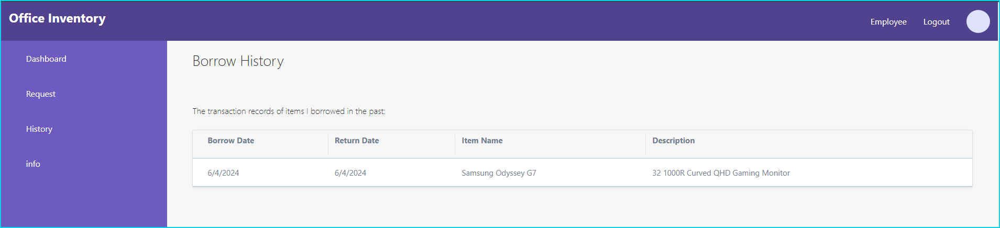
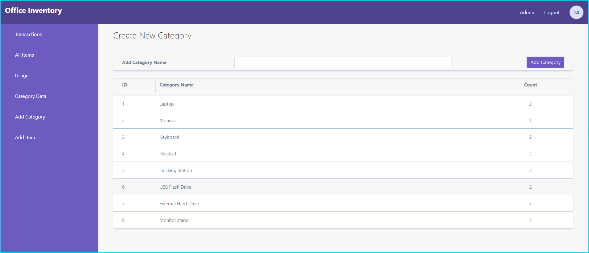

# Inventory Management System 

[](https://opensource.org/licenses/MIT) 

      

<p align="left">
    
    
    
    
</p>

## Description

Inventory Management System is full-stack Model-View-Controller configurated application which uses Handlebars.js as templating language, Sequelize as the Object-relational mapping processing technique for data handling and database operations, and the express-session npm package for authentication.

## Table of Contents 

- [Installation](#installation)
- [User Story](#user-story)
- [Acceptance Criteria](#acceptance-criteria)
- [Usage Info](#usage-info)
- [Contributing Guidelines](#contributing-guidelines)
- [Tests Instructions](#test-instructions)
- [License](#license)
- [Questions and Contacts](#questions-and-contacts)

## Installation
Because we need PostgreSQL database it should be installed at local machine drive and then loaded into npm node module packages. Installation process for postgresql we can find here [PostgreSQL Databse Installation](https://www.enterprisedb.com/downloads/postgres-postgresql-downloads). During the installation process default port should be set as default `5432`. After database is installed localy npm pg packages should be loaded into node modules over cli terminal.

```bash
$ npm install pg
```
After packages are loaded database credentials should be populated into `.env` file like username, password, and database name. Check .env file for details. Also, there is a file `~/db/schema.sql` and `~/seeds/seeds.sql` that can be used to set database structure and to populate database with testing seeds, just uncoment it and run. Check file `schema.sql` and `seeds.sql`. It can be runned as follows:

```console
$ psql -U postgres 
Password for user postgres:
psql (16.2)
postgres=# \i ./db/schema.sql
DROP DATABASE
CREATE DATABASE
CREATE TABLE
CREATE TABLE
CREATE TABLE
CREATE TABLE
postgres=# \i ./seeds/seeds.sql
INSERT 0 3
INSERT 0 5
INSERT 0 8
INSERT 0 5
postgres=# \c inventory_db
inventory_db=# 
```
Otherwise you can run seeds (`~/seeds/seeds.js`) over bash terminal as follows
```bash
$ nmm run seed # automate executable shortcuts scripts at package.json
```
Alternatively,
```bash
$ node seeds/seeds.js
```
<a id="user-story"></a>
## User story 
```
AS A business owner
I WANT that my employees are able to borrow and manage inventory items in my company
SO THAT I can organize and plan activities and run the business.
```
<a id="acceptance-criteria"></a>
## Acceptance criteria 
```
GIVEN responsive user intrface that accepts user inputs and perform operations on database
WHEN I start application
THEN I am presented with login interface and option to signup
WHEN I choose to signup I am redirected to signup page
THEN I have to insert my details, first name, last name, email and password
WHEN I choose to login I have to insert my credentials like email and password
THEN I am redirected to the employee dashboard
WHEN I choose to login as administrator and insert my credentials like email and password
THEN I am redirected to the admin dashboard
WHEN I am loged at employee dashboard 
THEN I am presented with currentlly borrowed item(s) and options to return item, make new request or to display borrow history
WHEN I choose to return the item
THEN that item is removed from currently borrowed list
WHEN I chose to make new borrow request
THEN I am presented with a list of available items that I can add to my borrow list
WHEN I choose to see borrow history
THEN I am presented with a list of all items that I have borrowed and returned in the past
```

<a id="usage-info"></a>
## Usage Info

IMS application can be helpfull to those who want to store and manage data about inventory items that can be borrowed by employees in an organisation.

<a id="contributing-guidelines"></a>
## Contributing Guidelines

Currentlly, at this stage there is no contributors but for more information any enquiry can be reffered to Question and Contact section.

<a id="test-instructions"></a>
## Test Instructions

Application runs by invoking command `$ npm start` at `~/Inventory_Management_System>` directory. Before running application, download compressed repo from githaub and installl packages globaly or at application root directory from the section [Installation](#installation). 

```bash
$ npm start 
```

Alternatively,
```bash
$ node server.js 
```

All automate executable scripts are stored at root directory `~/Invertory_Management_System>` in `package.json` file.
```json
"scripts": {
    "test": "jest",
    "start": "node server.js",
    "dev": "nodemon server.js",
    "seed": "node seeds/seeds.js"
  },
```
### IMS Login Page
At login page you have to insert your details like email and password.

[](./images/ims-login-2.PNG)

### IMS Sign Up Page
At sign up page if you do not have an account you can create one.

[](./images/ims-signup-2.PNG)

### IMS Employee Dashboard
IMS system redirects all pages to the individual dashboards excepts admin users. At employee dashboard, all current requests (borrowings) are displayed in the table with the option to return the item. If you click to return the item it will be removed from current list.

[](./images/employee-dashboard.PNG)

### IMS Add Request to the List
On teh left side menu you can choose to add new request to your list of items. System will render all currently available items with the option to choose one in the form of a button. When clisk on the button that item will be added to the list automatically. 

[](./images/request-item.PNG)

### IMS History Item(s)
At a left side menu bar you can choose to display the history of your request(s) in the past if any. 

[](./images/history-item.PNG)

### IMS Admin
System has only one administrator at this stage and if admin credentials are used over login admin page will be rendered automatically as follows.

[](./images/admin-dashboard.PNG)

### Deployed Application at Render
IMS Application is deployed at Render. You can follow this link [IMS Render Application Live](https://inventory-management-system-pioa.onrender.com/)

## License

Copyright © 2024, [IMS Project Group](https://github.com/LukeHunter1991/Inventory_Management_System). Released under the [MIT License](./LICENSE).

<a id="questions-and-contacts"></a>
## Questions and Contacts

Questions about application can be reffered to the author's [GitHub account](https://github.com/LukeHunter1991) or you can [Contact Us](mailto:fill-up-your-emails) directly over an email.
